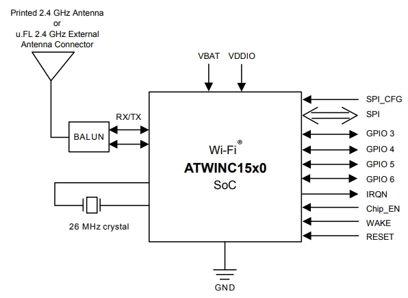
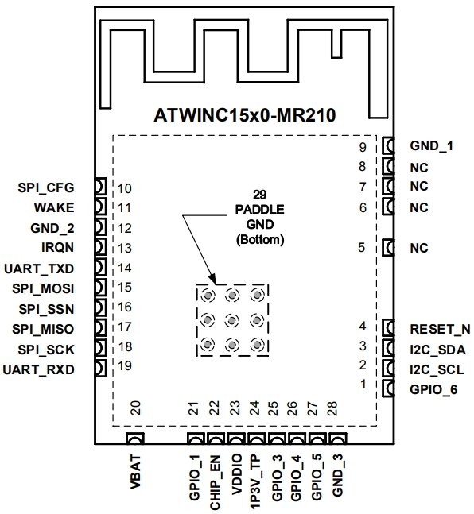
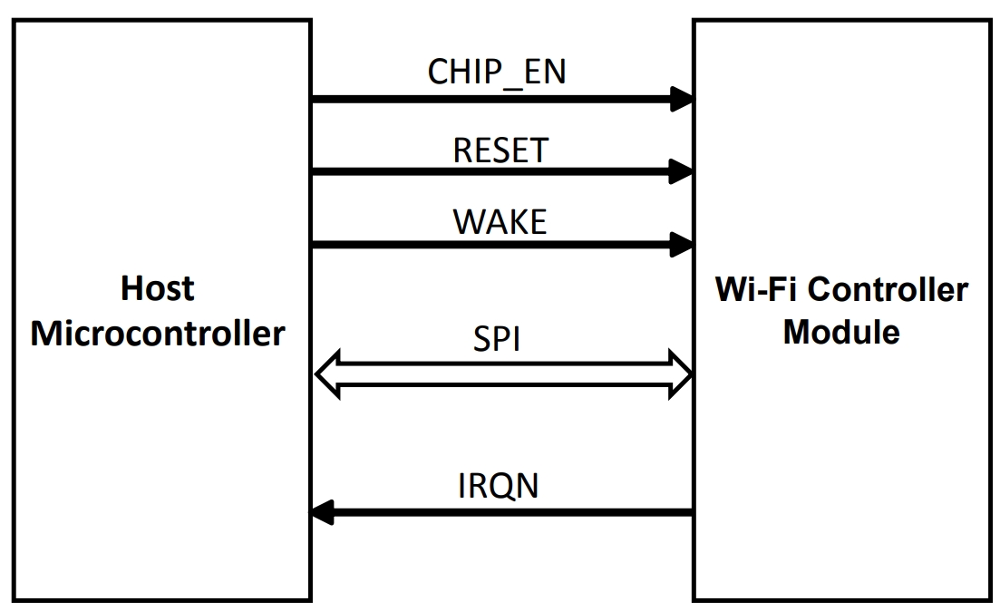
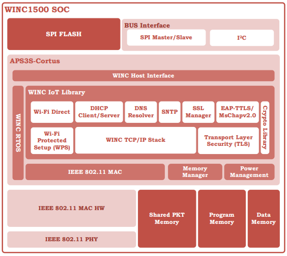
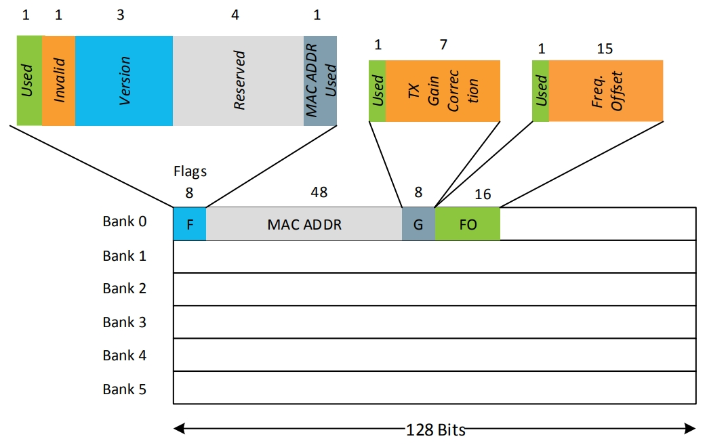
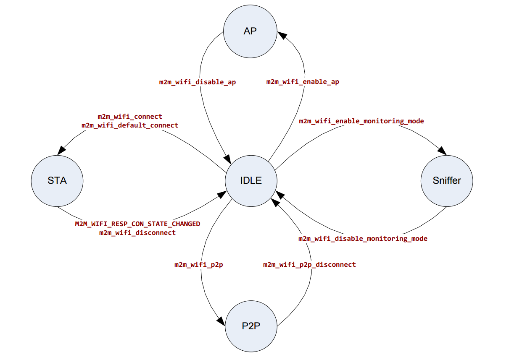

# Microschip's ATWIND1500 IEEE 802.11 b/g/n Wi-Fi Module

## Overview

**ATWINC15x0-MR210xB** is a low power WiFi (IEEE 802.11 b/g/n) module in QFN package.

It integrates Power Amplifier (PA), Low-Noise Amplifier (LNA), Switch, Power Management, and a printed antenna or a micro co-ax (u.FL) connector for an external antenna resulting in a 28-pins, small form factor (21.7 x 14.7 x 2.1 mm) design.

It provides SPI slave interface with a slave master (another microcontroller).

It provides UART interface with a host controller (another micontroller or PC).

It support WPA/WPA2 personal, WPA Enterpeise, TLS security protocols. it provides DHCP, DNS, TCP/IP (IPv4), UDP, HTTP and HTTPS network protocols.

It is able to operate up to 7 TCP sockets (as client or server) and up to 4 UDP sockets (client or server).

When it is in AP (Access Point) mode, it supports OPEN and WEP securities and allows 1 client.

AP and STA modes cannot co-exist.

The references to the ATWINC15x0-MR210xB module include the module devices listed in the following:

- ATWINC1500-MR210PB (4 MB flash, OTA, PCB antenna)
- ATWINC1500-MR210UB (4 MB flash, OTA, uFL connector)
- ATWINC1510-MR210PB (8 MB flash, OTA, PCB antenna)
- ATWINC1510-MR210UB (8 MB flash, OTA, uFL connector)

*Figure:* **ATWINC1500 block diagram**

*Figure:* **ATWINC1500 pins**

*Figure:* **Interface between ATWINC1500 and host microcontroller**

*Figure:* **ATWINC1500 System Architecture**

## CPU and Memory Subsystems

ATWINC15x0-MR210xB uses Cortus APS3 32-bit processor (CPU). The processor uses

- 128 kB instruction/boot ROM
- 160 kB instruction RAM
-  64 kB data RAM
- 4/8 MB flash memory which is used for system software
- 128 kB shared RAM for processor and MAC
- 768 bits non-volatile one-time-programmable (OTP) memory.

### Non-volatile One-time-programmable (OTP) Memory

ATWINC15x0-MR210xB have 768 bits of non-volatile eFuse memory that can be read by the CPU after device reset. This non-volatile TCP memory can be used to store customer-specific parameters, such as MAC address, various calibration information (such as Tx power, crystal frequency offset) and other software-specific configuration parameters.

The efuse is partitioned into 6 128-bit banks, which could be programmed independently. Each bank has the same bitmap. The purpose of the first 80 bits in each bank is fixe, and the remaining 48 bits are used by application.

ATWINC15x0-MR210xB is programmed with MAC address and frequency offset, etc at Bank 0 in factory. User can program Bank 1 and invalidate Bank 0 so that new MAC address and frequency offset, etc could be read from Bank 1.

*Figure:* **eFuse Bitmap**

### Interfaces

### SPI Slave Interface

ATWINC15x0-MR210xB provides a full-duplex slave Serial Peripheral Interface (SPI) to host (microcontroller) that can be used for control and for serial I/O of IEEE 802.11 data.  The pin 10 `SPI_CFG` must be tied to VDDIO via a 1 MΩ resistor.

| Pin No. | Name       | Description                                                         |
|:-------:|:----------:|:--------------------------------------------------------------------|
|    10   | `SPI_CFG`  | Use 1-MΩ pull-up resistor to enable the SPI interface               |
|    15   | `SPI_RXD`  | SPI MOSI (Master Output, Slave In) pin                              |
|    16   | `SPI_SSN`  | SPI Slave Select, active low                                        |
|    17   | `SPI_TXD`  | SPI MISO (Master In, Slave Out)                                     |
|    18   | `SPI_CLK`  | SPI Clock                                                           |

The maximum SPI speed is 48 MHz.

When the SPI is not selected (`SPI_SSN` is high), the SPI will not interfere with data transfers between master (host) and other SPI slave devices in the same SPI bus.

`SPI_SSN`, `SPI_MOSI`, `SPI_MISO` and `SPI_SCK` pins have internal programmable pull-up resistors. The resistors should be programmed to be disabled.  Otherwise, if any of the SPI pins are driven to a low level while ATWINC15x0-MR210xB is in the low power sleep stage, current will flow from the VDDIO supply through the pull-up resistors, hence increse current consumption during low power sleep mode.

Other unused pins should have its pull-up resistor enable to keep then from floating, which can cause excess current to flow through the pin from the VDDIO supply.  Pull-up resistor is approximately 100 kΩ, hence the leakage current is about VDD10/100k = 3.3/100k = 3.3 μA.

ATWINC15x0-MR210xB supports four standard SPI modes determined by Clock Priority (CPOL) and Clock Phase (CPHA) settings.

### UART Interface

ATWINC15x0-MR210xB supports Universal Asynchronous Receiver/Transmitter (UART) interface as DTE. This interface should be used for **debug purpose** only.

| Pin No. | Name       | Description                                                         |
|:-------:|:----------:|:--------------------------------------------------------------------|
|    14   | `UART_TXD` | UART Transmit. Output from ATWINC15x0-MR210xB                       |
|    19   | `UART_RXD` | UART Receive. Input to ATWINC15x0-MR210xB                           |

The default UART configuration is:

- Baud rate: 115200
- Data: 8 bit
- Parity: None
- Stop bit: 1 bit
- Flow control: None

### I2C Interface (In Development)

ATWINC15x0-MR210xB provides I2C interfacw which is still under development as in March 2018.

| Pin No. | Name       | Description                                                         |
|:-------:|:----------:|:--------------------------------------------------------------------|
|     2   | `I2C_SCL ` | I2C Slave clock. Under development                                  |
|     3   | `I2C_SDA`  | I2C Slave Data. Under Development                                   |

### Other Interface Pins

ATWINC15x0-MR210xB provides several pins for GPIO, Wake, Interrupt, Enable and Reset.

| Pin No. | Name         | Description                                                       |
|:-------:|:------------:|:------------------------------------------------------------------|
|     1   | `GPIO_6`     | General purpose I/O                                               |
|     4   | `RESET_N`    | Hard reset. Active-low. Use 1-MΩ pull-up resistor                 |
|    11   | `WAKE`       | Host wake up ATWINC15x0-MR210xB from doze mode                    |
|    13   | `IRQN`       | Output interrupt from ATWINC15x0-MR210xB to host                  |
|    21   | `GPIO_1/RTC` | General purpose I/O / RTC                                         |
|    22   | `CHIP_EN`    | Use pull-up to put module to active mode, other power-down mode   |
|    25   | `GPIO_3`     | General purpose I/O                                               |
|    26   | `GPIO_4`     | General purpose I/O                                               |
|    27   | `GPIO_5`     | General purpose I/O                                               |

## Opertion Modes

ATWINC15x0-MR210xB can function in the following modes:

- **Idle** mode\
  Enter when `m2m_wifi_init()` is called.\
  IEEE 802.11 radio and Cortus CPU are disabled.
  
- **Station** (STA) mode\
  Enter when `m2m_wifi_request_scan()` is called.\
  ATWINC15x0-MR210xB is able to scan and connect to access points.\
  It is possible to adjust how long ATWINC15x0-MR210xB scans each WiFi channel before it switches to the next channel. The longer the device spends on each channel, the more likely it is to detect an AP.  However, increasing this time wait also cause it to consume more power.\
  Use `m2m_wifi_connect()` or `m2m_wifi_defualt_connect()` to connect to an AP.\
  Use `m2m_wifi_disconnect()` to disconnect from an AP. It will return to Idle mode.
  
- **Access Point** (AP) mode\
  Support only 1 client in AP mode.\
  Support OPEN and WEP securities.\
  STA/AP cannot co-exist.\
  Use `m2m_wifi_enable_ap()` to enter AP mode.

- **Peer to Peer** (P2P or WiFi Direct) mode\
  Enable Wi-Fi devices to communicate without the use of dedicated access point.\
  This process begins with a WiFi Direct device scanning for other WiFi Derect devices. When another device is discovered, the devices will negotiate which device will function as the Group Owner (GO). The GO functions very similarly to AP. Once the GO is established, the other devices in the P2P group, (known as Clients), are able to connect to the GO in the same manner that STA's connect to AP's. The role of GO cannot be transferred to one of the Clients in the group. If the GO leaves the P2P group, the group is destroyed and must be reformed in order for the devices to continue to communicate.\
  ATWINC15x0-MR210xB is capable to operate as client in P2P mode only by calling `m2m_wifi_p2P()`.

- **Monitoring mode** (Sniffer mode)\
  ATWINC15x0-MR210xB receives all packets on a selected wireless channel.\
  User can configure filters so that only specific types of packets are passed to the application.\
  Call `m2m_wifi_enable_monitoring_mode()` to enter this mode.

*Figure:* **ATWINC15x0-MR210xB Mode Transition Diagram**

## Power Consumption

ATWINC15x0-MR210xB has several states:

**ON_TRANSMIT**\
ATWINC15x0-MR210xB is actively transmitting an 802.11 signal. Highest output power and nominal current consumption.\
`VDDIO` is ON and `CHIP_EN` is high.

**ON_Receive**\
ATWINC15x0-MR210xB is actively receiving an 802.11 signal. Lowest sensitivity and nominal current consumption.\
`VDDIO` is ON and `CHIP_EN` is high.

**ON_Doze**\
ATWINC15x0-MR210xB is ON but is neither transmitting nor receiving.\
`VDDIO` is ON and `CHIP_EN` is high.\
Current consumption is < 10 μA from `VDDIO` pin.

**Power_Down**\
ATWINC15x0-MR210xB core supply is off. Only leakage current is present.\
`VDDIO` is ON and `CHIP_EN` is low.
Current consumption is < 3.5 μA from `VDDIO` pin.

**IDLE_Connect**\
ATWINC15x0-MR210xB is connected with 1 DTIM (Delivery Traffic Indication Map) beacon interval.\
`VDDIO` is ON and `CHIP_EN` is high.

**Power_Off**\
DC/DC converter output and `VDDIO` pins are at ground potential.

